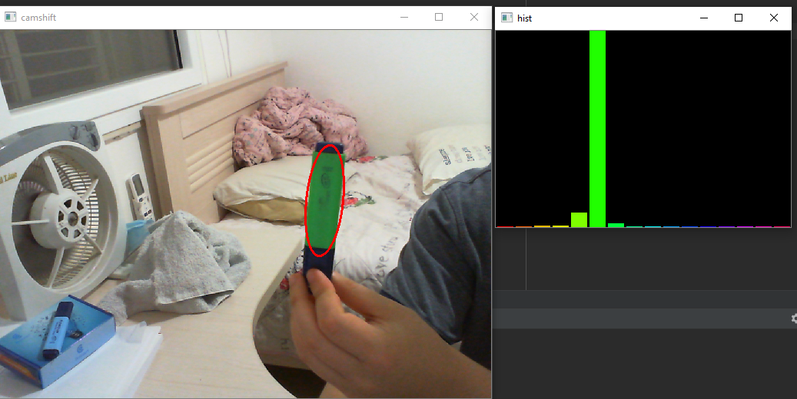
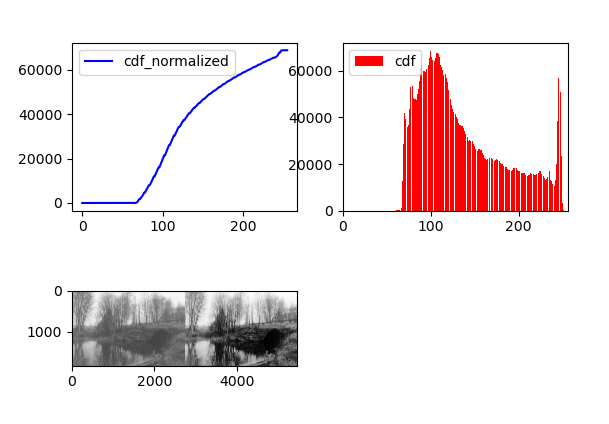
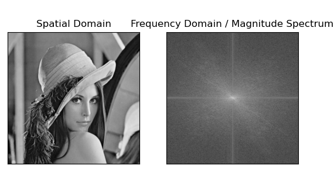

# OpenCV Demos and Examples

This repository contains examples in OpenCV to mess around with

*Mask blue color then apply mask to original image*

*Canny edge thresholding*

*Create depthmap from 2 stereo images (left, right eyes)*

*Reconstruct 3D model from stereo images*

*Track selected area by color*

*Histogram normalization (aka contrast)*

*Gradient sobel operator (or any operator)*

*Webcam filters*

*Remove noise / Add noise*

*Fourier transform to frequency domain*

*Grayscale images and videos (from webcam)*