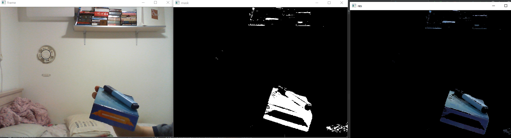
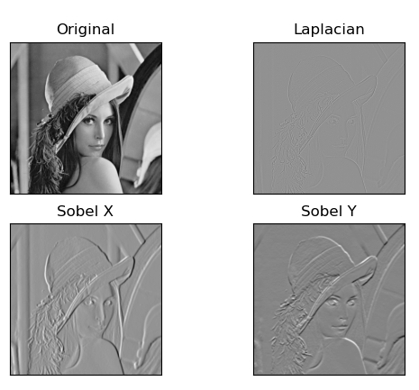
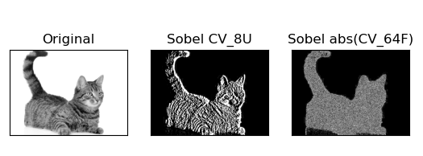
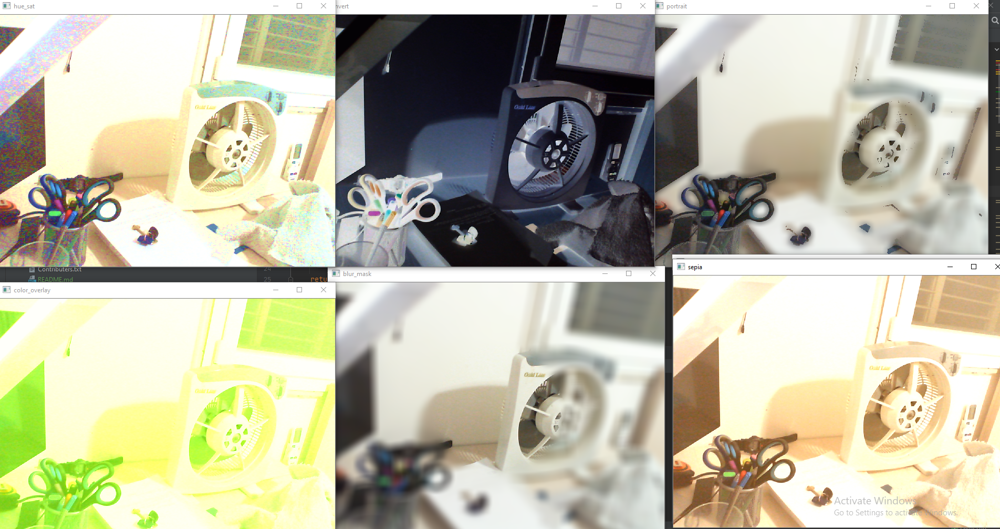
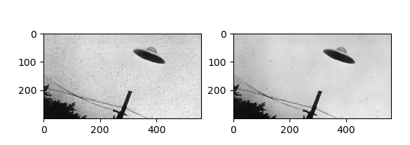
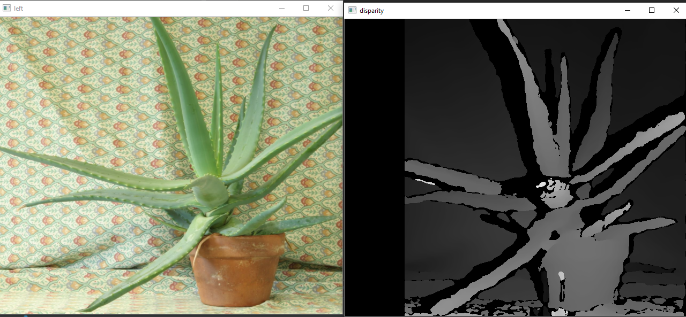
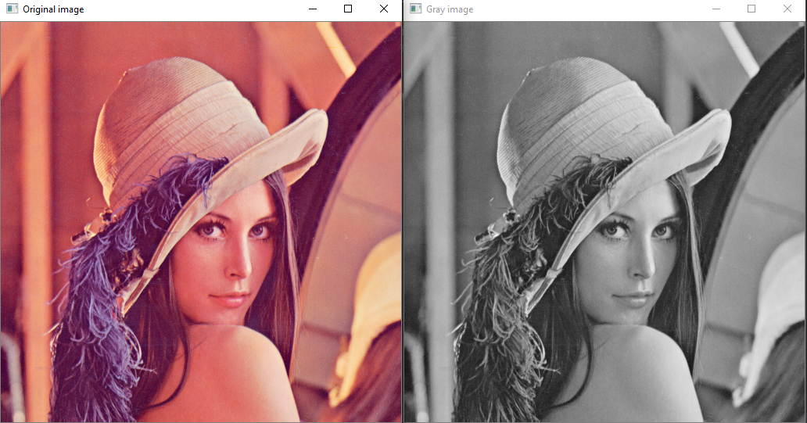

# OpenCV Demos and Examples

This repository contains examples in OpenCV to mess around with

*Mask blue color then apply mask to original image*

*Canny edge thresholding*

*Gradient sobel operator*

*Webcam filters*

*Remove noise*

*Create depthmap from 2 stereo images (left, right eyes)*

*Reconstruct 3D model from stereo images*

*Grayscale images and videos (from webcam)*